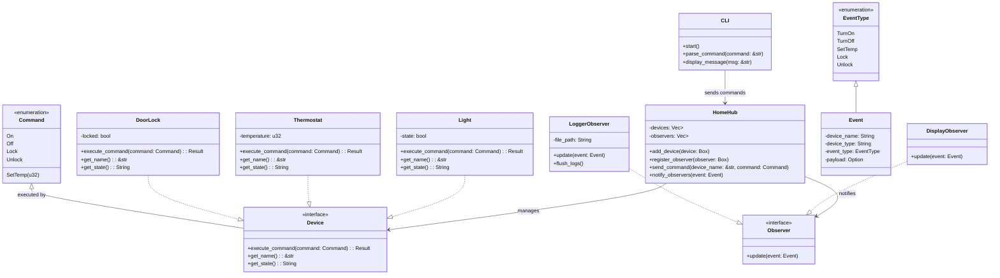
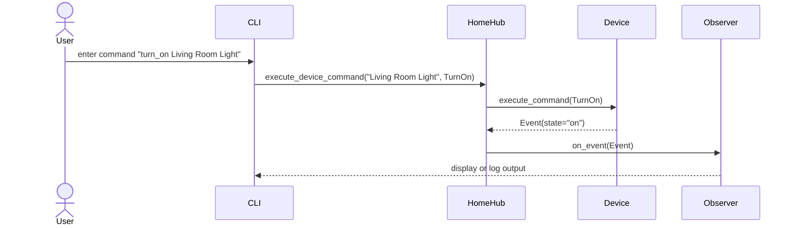

# PulseHome
[](LICENSE)

[](https://github.com/harshagarwal2245/PulseHome/actions/workflows/ci.yml)
[]()

---

**PulseHome** is a modular Rust-based smart home controller showcasing the **Observer** and **Mediator** design patterns using a **TDD approach**. The system allows users to interact with smart devices through a CLI, with events being observed and logged by registered observers.

---

## Features

- **Device Control**: Manage smart devices like lights, thermostats, and door locks.  
- **Observer Pattern**: Display and log events whenever a device changes state.  
- **Mediator Pattern**: Centralized hub (`HomeHub`) coordinates communication between devices and observers.  
- **TDD Approach**: Fully tested modules using Rust unit tests.  
- **User Interaction**: Command-line interface (CLI) to interact with the smart home.  
- **Extensible Architecture**: Easily add new devices or observers.

---

## Architecture

### Modules

- `devices/` – Implements smart devices (`Light`, `Thermostat`, `DoorLock`) using the `Device` trait.  
- `observer/` – Implements observers (`DisplayObserver`, `LoggerObserver`) using the `Observer` trait.  
- `models/` – Defines the core `Event` and `EventType` used throughout the system.  
- `mediator.rs` – Implements `HomeHub` that mediates between devices and observers.  
- `cli.rs` – Provides a command-line interface for user interaction.  

---

### Design Patterns

1. **Mediator Pattern**  
   - `HomeHub` acts as the mediator.  
   - Devices and observers never communicate directly.  
   - The hub receives commands, executes them on devices, and notifies observers.

2. **Observer Pattern**  
   - Observers register with `HomeHub` to receive device events.  
   - `DisplayObserver` prints events to the console.  
   - `LoggerObserver` writes events to a log file.

---

## Getting Started

### Prerequisites

- Rust 1.70+  
- Cargo

### Build and Run

```bash
# Clone the repository
git clone https://github.com/harshagarwal2245/PulseHome.git
cd PulseHome

# Build the project
cargo build

# Run the CLI
cargo run
```

### CLI Commands

- **turn_on `<device_name>`** – Turn on a device (e.g., light).  
- **turn_off `<device_name>`** – Turn off a device.  
- **lock `<device_name>`** – Lock a door lock.  
- **unlock `<device_name>`** – Unlock a door lock.  
- **list** – List all registered devices.  
- **add `<device_type>` `<device_name>`** – Add a new device at runtime.  
- **exit / quit** – Exit the CLI.

---

### Example

```
> list
Devices: Living Room Light, Front Door

> turn_on Living Room Light
[DisplayObserver] Device 'Living Room Light' (Light) state: on

> lock Front Door
[DisplayObserver] Device 'Front Door' (DoorLock) state: locked

> exit
```

---

## Testing

Run all unit tests:

```bash
cargo test
```

The system is fully tested for:

- Device operations  
- Observer notifications  
- Mediator command handling  

---

## Extending PulseHome

- **Add Devices**: Implement the `Device` trait and register with `HomeHub`.  
- **Add Observers**: Implement the `Observer` trait and register with `HomeHub`.  
- **Add Commands**: Extend CLI parsing and device command execution.

---

## Diagrams

### Class Diagram



---

### Sequence Diagram (Happy Path)



---

## License

MIT License – See [LICENSE](LICENSE)
